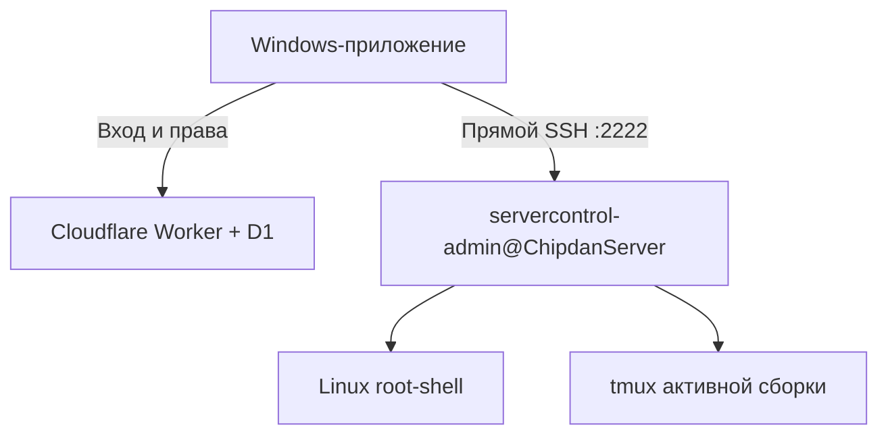

# Server Control 2

Windows-приложение для домашнего Debian-сервера `ChipdanServer` и нескольких изолированных Minecraft-сборок.

## Что осталось

- знакомое окно входа через Cloudflare Worker + D1;
- автоматическое обновление через проверяемый GitHub Release;
- компактный экран состояния питания, домашнего сервера и Minecraft;
- удобный менеджер Minecraft-сборок с переключением одной кнопкой;
- файловый проводник по `/opt/minecraft` с загрузкой с ПК, скачиванием, буфером обмена и корзиной;
- точное управление пользователями и правами;
- изменение собственного логина и пароля владельца;
- встроенный интерактивный SSH-терминал.

## Проводник (beta.17)

Раздел «Проводник» открывает общую папку `/opt/minecraft`. В карточке сборки
есть кнопка «Открыть папку сборки». Переход — двойным щелчком; доступны дерево
папок, адресная строка, хлебные крошки, назад/вперёд/вверх, поиск по текущей
папке и сортировка по заголовкам. Каталоги выводятся страницами по 200 элементов.

- Выделение нескольких файлов: Ctrl/Shift; Ctrl+A — всё на текущей странице.
- Ctrl+C, Ctrl+X, Ctrl+V — копирование и перемещение на сервере.
- «Загрузить с ПК» выбирает несколько файлов; «Загрузить папку» переносит её
  содержимое. Поддержаны перетаскивание из Windows и вставка скопированных в
  Проводнике Windows файлов через Ctrl+V. Внешние файлы всегда копируются на сервер.
- Двойной щелчок по текстовому файлу открывает UTF-8-редактор (до 2 МБ), Ctrl+S
  сохраняет. Если файл уже изменён другим процессом, перезапись отклоняется.
- Скачать можно отдельные файлы; папка скачивается ZIP-архивом. Символические
  ссылки и специальные файлы не обходятся.
- Delete перемещает в `/opt/minecraft/.server-control-trash`, Ctrl+Z или кнопка
  «Отменить удаление» восстанавливает последнее удаление в текущем сеансе.
  Корзина сохраняется между сеансами, автоматически не очищается и занимает диск.
- Перед заменой существующего файла запрашивается подтверждение. Загрузка
  записывается во временный файл, после полного приёма и подтверждения заменяет
  назначение. Отмена незавершённой передачи сохраняет исходный файл; при загрузке
  нескольких файлов ранее завершённые остаются на сервере.

Проводник использует отдельное проверенное SSH-соединение и не блокирует опрос
состояния. Нужны права `terminal.linux` и `minecraft.files.read`; для изменений —
`minecraft.files.write`. Владелец имеет доступ автоматически. Используется уже
настроенный административный SSH-доступ; обновлять Agent или Worker не требуется.
Изменять мир работающего Minecraft небезопасно: сначала остановите сборку.

Экспорт непереведённых строк полностью удалён из клиента и SSH-менеджера.

## Две прямые консоли

| Переключатель | Подключение |
|---|---|
| Linux | SSH → `sudo -n -i` |
| Minecraft | SSH → `sudo -n -u minecraft -H tmux attach-session -t dragonfyre` |

RCON не используется. Команды и вывод терминала не проходят через Worker, D1, Agent или очередь заданий.
Приложение быстро проверяет `192.168.0.108:22`: дома оно использует локальный адрес, а вне домашней сети автоматически переключается на `46.175.223.107:2222`.
Роутер направляет внешний порт на отдельный `192.168.0.108:2222`, где SSH разрешает вход только техническому пользователю приложения; обычный локальный вход `chipdan` на порту `22` наружу не публикуется.

## Поток подключения



## Права

- просмотр состояния;
- Linux-консоль с административными правами;
- прямая Minecraft-консоль;
- управление питанием;
- просмотр, запуск и остановка сборок;
- импорт ZIP, клонирование и настройка сборок;
- отдельное разрешение на удаление сборок;
- управление пользователями.

Владелец всегда имеет полный доступ. Блокировка и отзыв сеансов проверяются сервером при каждом API-запросе; Windows-клиент дополнительно перепроверяет учётную запись каждые пять секунд и закрывает активные терминалы при отзыве доступа.

## Безопасность SSH

- отдельный пользователь `servercontrol-admin`;
- отдельный `servercontrol-minecraft`, чей ключ принудительно открывает только tmux активной сборки;
- оба входят только по разным ключам, без SSH-паролей;
- ключи хранятся в секретах Worker и не попадают в GitHub или ZIP приложения;
- приложение проверяет точный SHA-256 отпечаток SSH-сервера;
- SSH agent, port forwarding, X11 и туннели для этой учётной записи отключены;
- владелец сознательно выдаёт полный Linux-доступ только пользователям с правом Linux-консоли.

Пользователь Linux-консоли технически может сохранить полученный admin-ключ из памяти процесса, поэтому после удаления недоверенного Linux-администратора ключ следует заменить. Minecraft-пользователи получают другой ключ, принудительно ограниченный tmux-сессией.

## Компоненты

| Компонент | Назначение |
|---|---|
| `desktop/` | Python 3.12, Tk/ttk, Paramiko и pyte; Windows EXE и updater |
| `worker/` | авторизация, D1-пользователи, права, статусы и выдача SSH-сессии |
| `agent/` | инфраструктурные установщики и tmux-runner прямой Minecraft-консоли |
| `tests/` | Python и Worker regression/security tests |

Полная установка с крупными блоками команд и ожидаемым результатом: [docs/V2_SETUP.md](docs/V2_SETUP.md).

## Проверки

```bash
python -m unittest discover -s tests -p "test_*.py" -v
node --test tests/worker_auth.test.mjs
node --check worker/src/index.js
node --check worker/src/control_plane.js
sh -n agent/install-v2-console.sh
```
