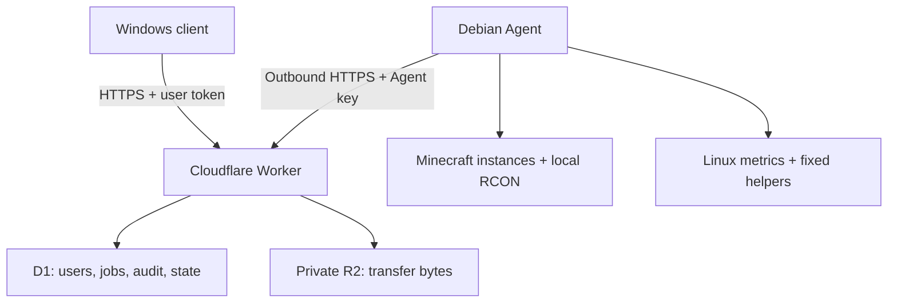

# Архитектура Server Control 1.0

## Поток данных

The home network has no inbound control port. Client and Agent do not talk
directly; the Worker is the authorization and durable job boundary.

## Module boundaries

### Desktop

- `main.py`: configuration, login, theme, client update and application life cycle.
- `control_panel.py`: sidebar shell, independent status/power/event/notification
  feeds, shared command palette, background-thread/UI-thread boundary and Agent
  readiness checks.
- `state.py`: bounded in-memory state and atomic non-secret preferences.
- `api.py`: bounded HTTP, job waiting and chunked R2 transfers.
- `pages_*.py`: dashboard, Minecraft, files/backups, system and administration.
- `widgets.py`: console, command input, editor, metric cards, palette and transfer UI.
- `updater.py` / `apply_update.py`: verified staged update and rollback.

Tk calls stay on the main thread. Network and long work run in daemon worker
threads and post small callbacks into a bounded per-frame UI drain.

### Control Hub

- `worker/src/index.js`: authentication, legacy compatibility, power integration,
  Agent heartbeat/events and common request guards.
- `worker/src/control_plane.js`: API v2 routes, RBAC, jobs, sync, transfers,
  notifications, audit and scheduled maintenance.
- `worker/migrations/`: forward-only D1 schema changes. Migration `0004` does not
  remove or rename old tables, so a rolling `0.3.x` → `1.0` deployment remains
  reversible at the application level.

### Agent

- `server_control_agent.py`: Agent loop, metrics, persistent RCON/log tracking,
  heartbeat and legacy command compatibility.
- `sc_agent/instances.py`: validated profiles and secret-free runner profiles.
- `sc_agent/jobs.py`: bounded concurrent job execution and orchestration.
- `sc_agent/files.py`: root-confined file operations and pagination.
- `sc_agent/backups.py`: ZIP backups, restore and retention.
- `sc_agent/system.py`: cached host/process/storage/Java/service inventory.
- `sc_agent/security.py`: canonical paths, safe extraction, atomic writes and hashes.
- `instance_runner.py`: executes only a reviewed argument vector for one profile.
- `service_control_helper.py`: root-owned exact action/unit gate.
- `agent_update_helper.py`: download, manifest/hash verification, activation,
  health confirmation and rollback.

## State and jobs

A long operation is never tied to an open page. The Worker creates a D1 job with
an optional exclusive lock. Agent claims it, heartbeats progress and stores a
final result. A second equivalent request reuses the active job; a conflicting
request receives `409 operation_locked`.

Typical lock domains:

| Domain | Protected operations |
|---|---|
| `instance:<id>:exclusive` | start/stop/restart/kill/update/restore/delete |
| `instance:<id>:backup` | backup creation |
| `server:power` | Linux reboot/shutdown |
| `agent:update` | Agent update and all overlapping jobs |

The UI changes immediately to queued/running state and continues receiving job
progress even after another page is opened.

## Independent desktop feeds

The desktop deliberately does not make one large response the authority for the
whole UI. `GET /v1/server/status` drives the connection indicator and dashboard.
Power, console events and notifications have separate schedules and failure
handling. Last known data stays visible when an optional feed fails. The former
`GET /v1/sync` route remains available only for rolling compatibility with older
clients.

The Agent similarly uses one `/v1/agent/sync` request for legacy commands, jobs
and cancellations. During Worker rolling deployment it can temporarily fall
back to the old command/job routes.

## Multiple Minecraft instances

The complete profile store is root-readable only through the Agent account and
contains RCON credentials. A second generated runner store excludes those
credentials and is readable by the `minecraft` service. Each managed instance
uses `server-control-minecraft@<id>.service` and a separate directory under
`/opt/minecraft`.

An imported archive is extracted into staging, validated, flattened only when a
single wrapper directory is unambiguous, inspected for loader/JAR/scripts and
then converted into a profile. Unknown scripts are data until an administrator
reviews and saves a startup command.

## File transfers

Bytes never travel as JSON/Base64:

1. Worker creates an authorized transfer record and private R2 object key.
2. Client or Agent streams multipart chunks with retry and progress.
3. Worker records ETags and completes the private object.
4. Agent imports to a temporary local path, checks SHA-256, then atomically
   places the file below the selected instance root.
5. Scheduled maintenance deletes expired D1 metadata and R2 objects.

Downloads use the inverse flow. A directory or backup is first archived by the
Agent, then streamed to R2 and downloaded to a local `.part` file.

## Compatibility policy

- API and Agent protocol are explicit numbers in health/sync responses.
- The Worker supports both underscore-style `0.3.x` permissions and dotted
  granular permissions while accounts are migrated naturally on edit.
- Legacy server/power/status routes remain filtered and functional.
- New UI operations require protocol 2 and fail locally with a clear message
  instead of queuing work an old Agent cannot execute.
